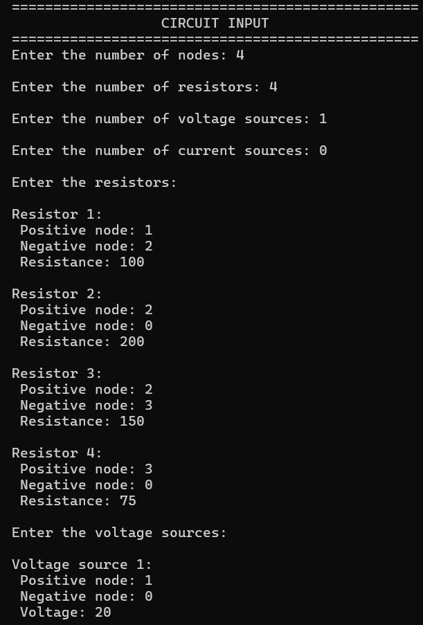
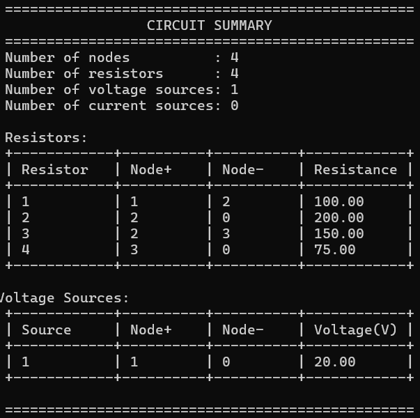
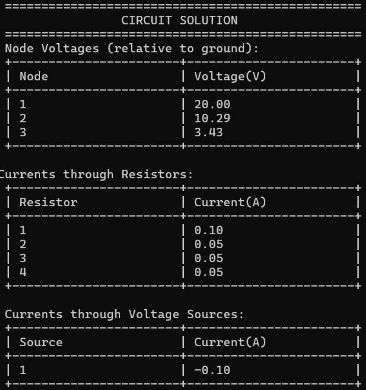

# DC circuit solver

## Overview

This project is a C-based circuit analysis tool that solves DC circuits using Modified Nodal Analysis (MNA) and Gaussian elimination.

The program reads a circuit definition, constructs the system of linear equations representing the circuit, and solves for node voltages and branch currents. The solver supports resistors, voltage sources, and current sources and produces neatly formatted console output describing the circuit and its solution.

The goal of this project was to combine concepts from programming, circuit analysis, and linear algebra to build a simplified circuit simulator similar in principle to tools like SPICE.

## What I Learned

- Implementing Modified Nodal Analysis for circuit simulation
- Constructing and solving linear systems of equations in C
- Designing data structures for circuit components
- Managing dynamic memory and matrix operations
- Building clean and readable console interfaces

## Images

### Manual Input

### Printing Circuit Summary

### Circuit Solution

## Possible Future Improvements

- Support for additional components (capacitors, inductors)
- Transient and AC analysis
- Sparse matrix solver for larger circuits
- Netlist-style circuit input similar to SPICE
